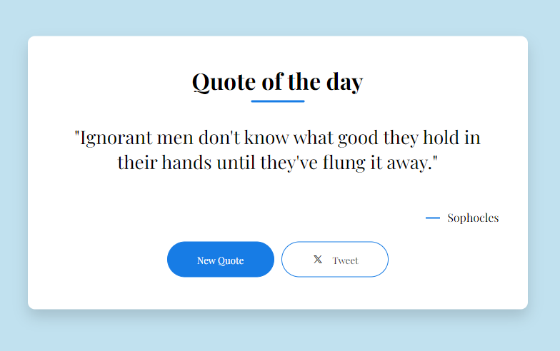

Certainly! Here's a README template for your HTML, CSS, and JavaScript-based quote generator:

---

# Quote Generator

## Description

This is a simple web-based quote generator that displays random quotes to users. It's built using HTML, CSS, and JavaScript.



## Table of Contents

- [Features](#features)
- [Demo](#demo)
- [Installation](#installation)
- [Usage](#usage)
- [Contributing](#contributing)
- [License](#license)

## Features

- Randomly generates and displays quotes.
- User-friendly interface with a stylish design.
- Easy to integrate into your website or project.

## Demo

You can see a live demo of the quote generator [here](#).

## Installation

1. Clone this repository to your local machine:

   ```bash
   git clone https://github.com/ngww/quote-generator.git
   ```

2. Open the `index.html` file in your web browser to use the quote generator.

## Usage

1. Open the `index.html` file in your web browser.
2. Click the "Generate Quote" button to display a random quote.
3. Enjoy the inspirational or thought-provoking quotes!

Feel free to customize the appearance and behavior of the quote generator by modifying the CSS and JavaScript files to suit your needs.

## Contributing

If you'd like to contribute to this project, please follow these steps:

1. Fork the repository.
2. Create a new branch for your feature or bug fix: `git checkout -b feature-name`
3. Make your changes and commit them: `git commit -m 'Add new feature'`
4. Push to your branch: `git push origin feature-name`
5. Create a pull request, explaining your changes in detail.

## License

This project is licensed under the [MIT License](LICENSE).
